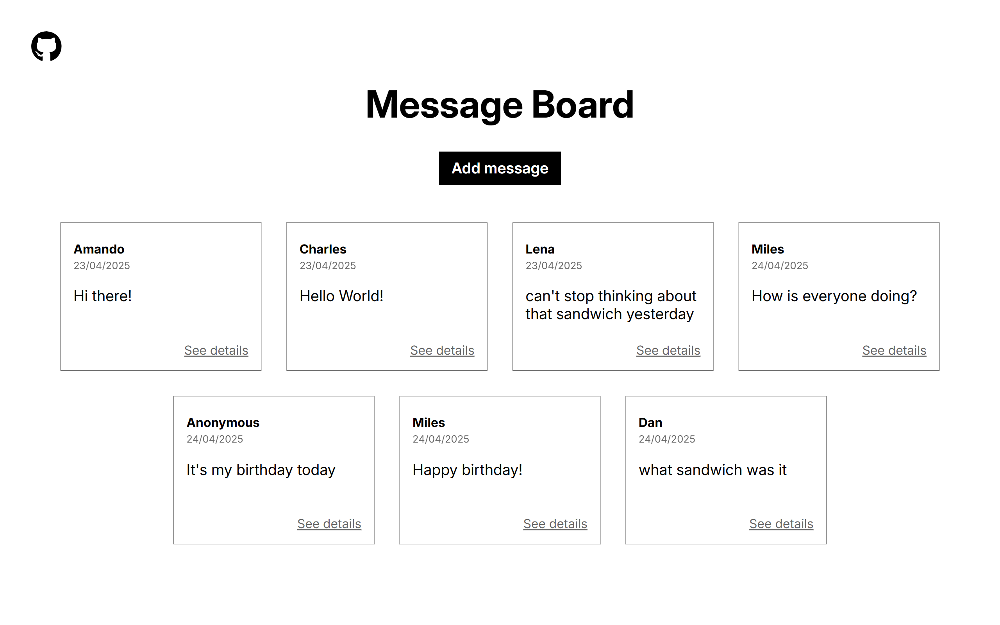

# Message Board

The Odin Project - NodeJS Course Project (1/8):

A simple message board built using Express.js (NodeJS) and EJS. Users can view existing messages or post their own messages, which are then displayed on the homepage.

## Preview

## Links

Live link:

Assignment: https://www.theodinproject.com/lessons/node-path-nodejs-mini-message-board
